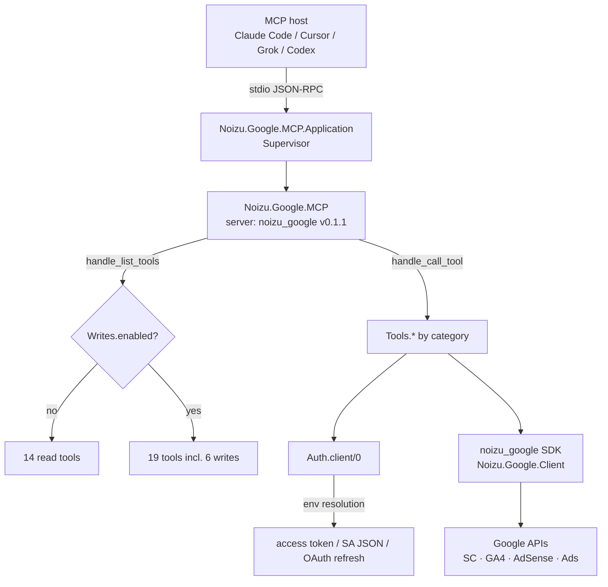

# Architecture — noizu_google_mcp

## Overview

`noizu_google_mcp` is a stateless Elixir MCP server exposing Google marketing APIs
(Search Console, GA4 Admin/Data, AdSense, Google Ads) as MCP tools over **stdio**.
It is a thin orchestration layer: tool modules translate MCP calls into
`Noizu.Google.Client` SDK calls (`:noizu_google` sibling library), which own HTTP,
auth token mechanics, and Google API semantics. Distributed as a Hex package
(`noizu_google_mcp`); consumed by NPL/tobor MCP hosting layers and any MCP host
(Claude Code, Cursor, Grok, Codex).

## System Diagram

## Core Components

| Component | Purpose |
|-----------|---------|
| `Noizu.Google.MCP` (server) | Registers 19 tools; dispatches calls; filters tool listing through write gate |
| `Noizu.Google.MCP.Application` | OTP supervisor — starts server with `transport: :stdio` unless `start_stdio: false` (set in test env) |
| `Noizu.Google.MCP.Auth` | Builds `Noizu.Google.Client` from env/app config; maps SDK errors to MCP strings |
| `Noizu.Google.MCP.Writes` | Write-gate: `GOOGLE_MCP_WRITES=1` opt-in; hides + rejects the 6 write tools otherwise |
| `Tools/{SearchConsole,Analytics,AdSense,Ads}` | One module per tool; declares input schema + calls the SDK |

→ *Components ↔ directories: see [PROJ-LAYOUT.md](PROJ-LAYOUT.md)*

## Data Flow

1. Host spawns server via `bin/noizu-google-mcp` (cds into project; Grok has no cwd field) or `mix run --no-halt`.
2. `tools/list` returns only visible tools (write tools hidden unless opted in).
3. `tools/call` → write-gate check → tool `call/2` → `Auth.client/0` (fresh token per call) → SDK call → result wrapped to MCP.

→ *Tool contracts: [PROJ-SCHEMA.md](PROJ-SCHEMA.md) · [schema/mcp-tools.md](schema/mcp-tools.md)*

## Key Decisions

- **Stdio only** — never exposed over unauthenticated HTTP; no network listener, no state.
- **Reads default, writes opt-in** — write tools are hidden from `tools/list` *and* rejected at dispatch (defense in depth, both paths in `mcp.ex`); Ads mutates add a second `dry_run`/`confirm` latch.
- **Token per call** — `Auth.client/0` resolves credentials on every invocation; no cached global state, no refresh persistence.
- **Sibling dep override** — `noizu_google` resolves to local path `../../api/elixir-google` when present (monorepo dev), else Hex `~> 0.2.4`.
- **No DB / no KV** — entirely stateless; all inputs arrive per call.

## Technology Stack

Elixir ~1.18 / OTP 28 · `noizu_mcp ~> 0.1.5` (server framework) · `noizu_google ~> 0.2.4` (Google SDK) · `jason` · ExDoc (dev).
Mix tasks: `mix deps.get && mix compile`, `mix test`, `mix format`, `mix credo`.
