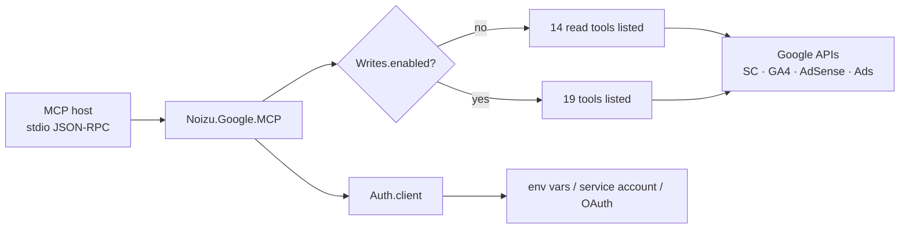

# Project Schema — noizu_google_mcp

Data schema reference. Source map: [PROJ-LAYOUT.md](PROJ-LAYOUT.md).

**No relational store.** This is a stateless stdio MCP server library: no Ecto schemas, no Liquibase changelogs, no KV/Redis, no seed data. The structured data in this repo is:

1. **Interface schema** — the 19 MCP tool contracts (inputs, gating, annotations) → [schema/mcp-tools.md](schema/mcp-tools.md)
2. **Config schema** — environment variables consumed by `Noizu.Google.MCP.Auth` / `Writes` (below)

## Config schema (environment variables)

Resolution order for auth (`Auth.client/0` → `Client.ensure_access_token/1`):
access token → service account → OAuth refresh trio. Empty strings are treated as unset.

| Variable | Aliases | Purpose |
|----------|---------|---------|
| `GOOGLE_ACCESS_TOKEN` | `GOOGLE_MARKETING_ACCESS_TOKEN` | Pre-obtained access token (first choice) |
| `GOOGLE_APPLICATION_CREDENTIALS` | `GOOGLE_CREDENTIALS_FILE`, `GOOGLE_SERVICE_ACCOUNT_FILE` | Path to service-account JSON |
| `GOOGLE_SERVICE_ACCOUNT_JSON` | — | Inline service-account JSON object (overrides file) |
| `GOOGLE_REFRESH_TOKEN` | `GOOGLE_MARKETING_REFRESH_TOKEN` | OAuth refresh token (with client id/secret) |
| `GOOGLE_CLIENT_ID` | `GOOGLE_MARKETING_CLIENT_ID` | OAuth client id |
| `GOOGLE_CLIENT_SECRET` | `GOOGLE_MARKETING_CLIENT_SECRET` | OAuth client secret |
| `GOOGLE_SUBJECT` | `GOOGLE_IMPERSONATE` | Domain-wide delegation subject |
| `GOOGLE_SCOPES` | `GOOGLE_SERVICE_ACCOUNT_SCOPES` | Space-separated scopes; default `webmasters` |
| `GOOGLE_ADS_DEVELOPER_TOKEN` | — | Ads API developer token (per-call override: tool arg `developer_token`) |
| `GOOGLE_ADS_LOGIN_CUSTOMER_ID` | — | MCC login customer id (per-call override: tool arg `login_customer_id`) |
| `GOOGLE_MCP_WRITES` | — | `1`/`true`/`yes` enables write tools; absent = read-only server |

## Interface schema summary

19 tools across 4 categories (SearchConsole 8, Analytics 4, AdSense 3, Ads 4).
6 are write-gated (`GOOGLE_MCP_WRITES=1`); Ads writes additionally default `dry_run=true`
and require `confirm=true` for live applies. Full input tables: [schema/mcp-tools.md](schema/mcp-tools.md).

## Maintenance notes

- Tool set changed? Regenerate the tool tables in `schema/mcp-tools.md` from the `field(` declarations in `lib/noizu/google/mcp/tools/**` and the registrations in `lib/noizu/google/mcp.ex`.
- Write-gate membership lives in `lib/noizu/google/mcp/writes.ex` (`@write_modules` / `@write_names`).
- Host-side config example: `.mcp.json.example` (stdio only — never HTTP).
