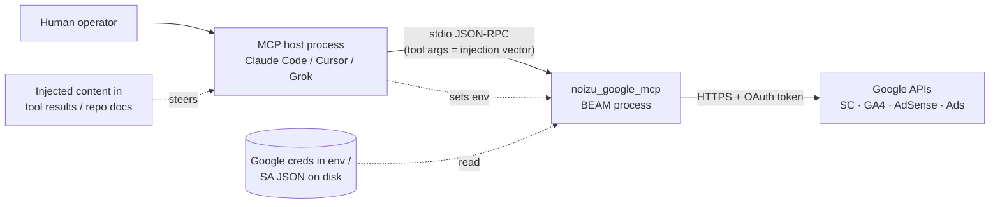

# Threat Model — noizu_google_mcp

## Overview

Stateless stdio MCP server exposing **read and write** access to Google marketing
accounts (Search Console, GA4, AdSense, Google Ads). The crown jewels are the
Google credentials in the host's env (service-account JSON, OAuth client
secret/refresh token, Ads developer token) and the Google-side data those grant.
There is **no network listener**: the primary trust boundary is
`MCP host process ↔ server process`, plus `server process ↔ Google APIs`.
The pivotal risk is an LLM agent being steered (prompt injection) into invoking
gated write tools once `GOOGLE_MCP_WRITES=1` is set.

## Attack Surface

Boundaries crossed: (1) host → server via stdio (tool args untrusted); (2) server → Google
(credentialed egress); (3) filesystem → server (service-account JSON read, sibling dep path).

## Vulnerability Register

| ID | Severity | STRIDE | Component | Status |
|----|----------|--------|-----------|--------|
| T-001 | High | Elevation of privilege | Write tools callable by agent | Mitigated (opt-in `GOOGLE_MCP_WRITES`, hidden from `tools/list` + dispatch rejection) |
| T-002 | Medium | Elevation of privilege | Prompt injection steering agent to call writes once enabled | Partial (Ads `dry_run`/`confirm` latch; SC writes need `confirm=true`; no human-in-loop enforcement) |
| T-003 | Medium | Information disclosure | Google creds in process env / host MCP config | Accepted (stdio-only design; `.mcp.json` is host-side responsibility — see `.mcp.json.example` warning) |
| T-004 | Low | Information disclosure | `Auth.format_error` inlines error `body` into tool results | Open (aids debugging; bodies can echo request context) |
| T-005 | Medium | Repudiation | No local audit log of mutations | Open (Google-side history only; nothing recorded server-side) |
| T-006 | Medium | Tampering | Sibling dep override `../../api/elixir-google` on disk controls SDK | Accepted (dev convenience; path must exist locally to activate — treat filesystem write access as game over) |
| T-007 | Low | Spoofing | `GOOGLE_ACCESS_TOKEN` / inline `GOOGLE_SERVICE_ACCOUNT_JSON` supplied via env | Accepted (equivalent to credential possession; env treated as trusted input) |
| T-008 | Low | DoS | Server crash kills host's MCP session | Accepted (supervisor restarts; no listener to flood; erl_crash.dump local-only) |
| T-009 | Low | Tampering | `bin/noizu-google-mcp` prepends standard paths to PATH | Accepted (fixed prefixes, no dynamic lookup; script is committed & reviewable) |

## Mitigation Coverage

2 mitigated · 2 partial/accepted-with-control · 5 open/accepted. Detail:

- **T-001** — double gate in `mcp.ex`: write tools removed from `tools/list` (invisible) *and* rejected in `handle_call_tool` even if called by name. Gate membership centralized in `writes.ex`.
- **T-002** — defense in depth on the two most destructive surfaces: `Ads.Mutate`/`CreateConversionAction` default `dry_run=true` (validateOnly) and require explicit `confirm=true`; `SitesDelete`/`SitemapsDelete` require `confirm=true`. Tools carry `destructive_hint: true` annotations so cooperating hosts can prompt. Gap: Search Console `SitesAdd`/`SitemapsSubmit` have no confirm latch.
- **T-003/T-007** — secrets never logged (no `Logger` use in `lib/`); empty-string env values treated as unset to avoid blank-credential confusion.
- **T-004/T-005** — no local mitigation; see Residual Risk.

## Residual Risk

- With `GOOGLE_MCP_WRITES=1`, a sufficiently steered agent **can** perform
  SearchConsole adds/submits without a confirm flag, and confirm flags are
  machine-supplied — they rate-limit injection, not stop it. Operators who
  enable writes accept this; the README/config example says stdio-only and
  never unauthenticated HTTP.
- No local write audit trail (T-005) and verbose error bodies (T-004) are
  accepted for now; revisit if the server is ever embedded in a multi-tenant host.

*Grounding: [PROJ-ARCH.md](PROJ-ARCH.md) (components/data flow) · [PROJ-LAYOUT.md](PROJ-LAYOUT.md) (code map) · [schema/mcp-tools.md](schema/mcp-tools.md) (tool contracts).*
